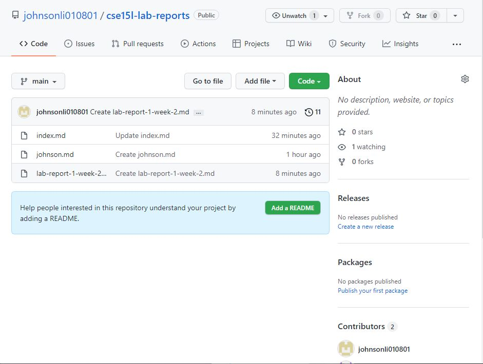

**Welcome to take a look at the first lab report of Junpeng(Johnson) Li**
>
*In this lab report, you can learn how to set up the VScode, remotely connecting to the server,
scp some files to the server setting the SSH key and optimizing the remote running*
>

>
___
# Installing VScode
* [VScode](https://code.visualstudio.com/)
* By clicking at the link on the top, it will guide you toward a website about downloading the VScode. You can download any versions you want from that website. Such as, macos, window, linux and so on.

[lab Report 1](lab-report-1-weel-2.html)
[lab Report 1](https://johnsonli010801.github.io/cse15l-lab-reports/lab-report-1-week-2.html)
