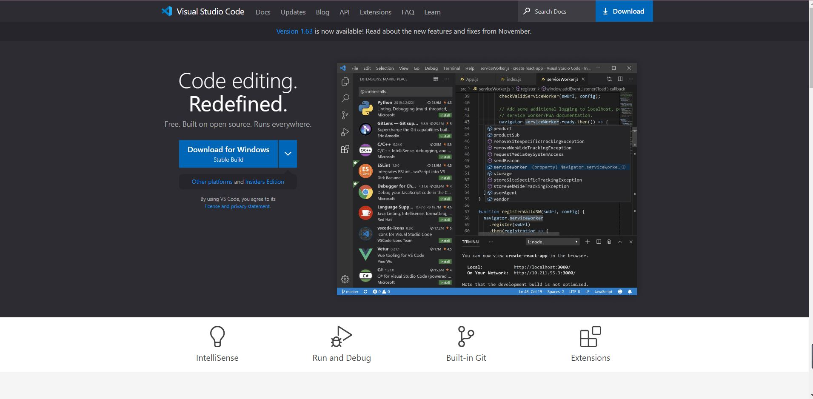
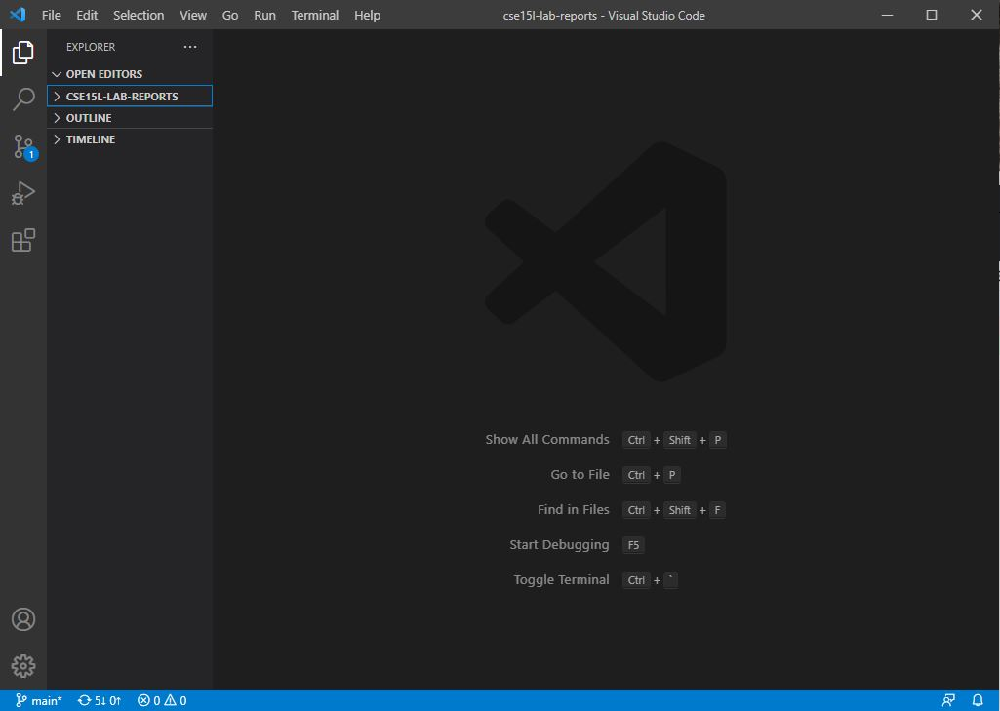
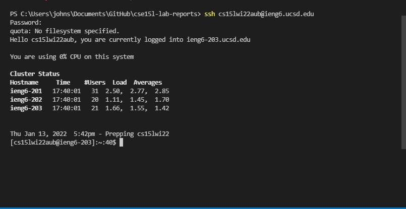
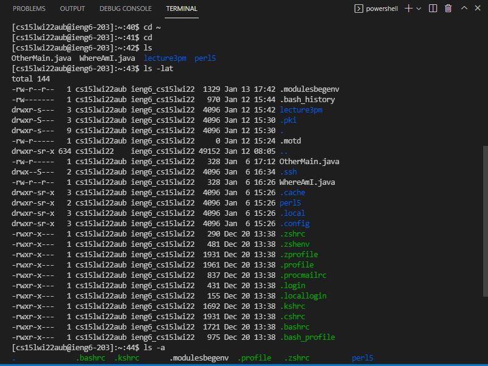
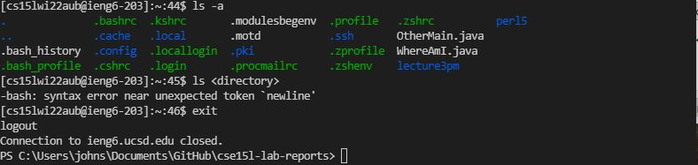
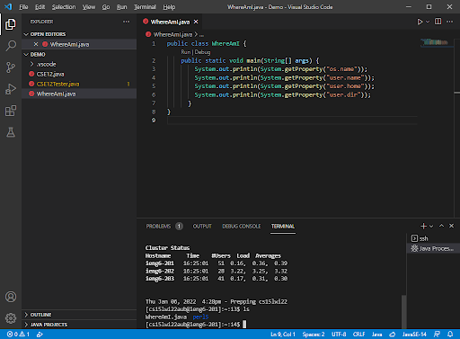
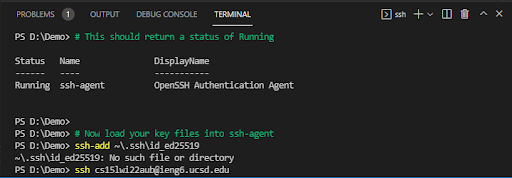
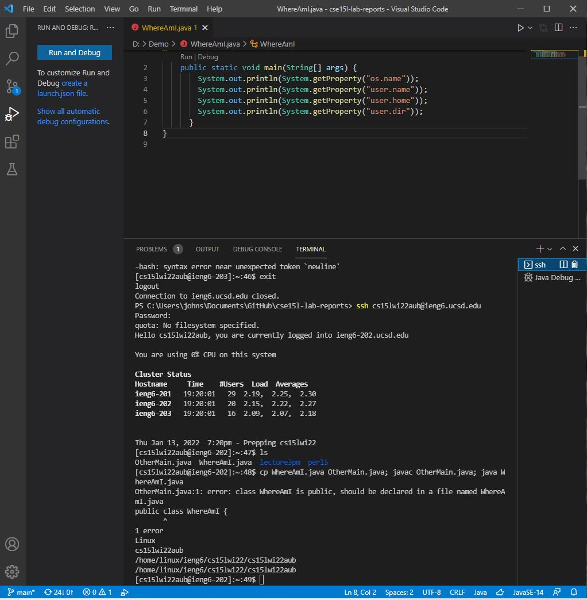

**Name:Junpeng Li**
>
**Professor Joe**
>
**Course:CSE 15L**
>
**Date:01/13/2022**
>
**Welcome to take a look at the first lab report of Junpeng(Johnson) Li**
>
*In this lab report, I will demonstrate how I have done to set up the VScode, remotely connecting to the server,
scp some files to the server setting the SSH key and optimizing the remote running*
>

>
# Installing VScode
* [VScode](https://code.visualstudio.com/)
By clicking at the link on the top, it will guide me toward a website about downloading the VScode. I can download any versions I want from that website. Such as, macos, window, linux and so on.

Here is what the website looks like. Since each different operating system will have different versions of vscode.I can click the downward arrow near the *download for window* to select the correct version for my computer.
>
After finishing downloading the vscode file, I double clicked at it. Then it will start installing to my computer.

This is what exactly looked like after I open the VScode app.
>
# Remotely Connecting
Since I am a window user, I should follow the following link to download the OpenSSH using the Window Setting first.
[Step to download OpenSSH](https://docs.microsoft.com/en-us/windows-server/administration/openssh/openssh_install_firstuse)
>
Then I have finished setting up my course special acocunt ready from the website before class.[course-special-account](https://sdacs.ucsd.edu/~icc/index.php)
>
**After that I typed this command in the terminal of the vscode to log into the server remotely**
```
$ ssh cs15lwi22aub@ieng6.ucsd.edu
```

>
It asked me for my password when I typed in the log in command in the console. Once I finished typing the password, I clicked enter from the keyboard to confirm the password in order to log into the server. Furthermore, it asked me to answered the question*Are you sure you want to continue connecting(yes/no/[fingerprint])?* at the first time when I logged in. Simplely, I answered yes to continue to connecting to the server.(But this picture is not the screenshot of what I did on the first time.)
# Running some command


>
For this section, I have tried some basic commands to see what would happen to the terminal. For instance, when I typed in `cd ~`
,nothing would happen because this command literally means changing the directory to the home directory. Since I am working at home directory, nothing would happen. For command `cd`, we will need to specify the address of which file are we gonna change directory to.
* `ls` Moreover, I have also tried the ls command in the terminal, then it lists all the files that exist in the server within my account.
* `ls -lat` This particular command will list all the files including who edited them and when they were edited.
* `ls -a` This is the command that I tried to list all the files within the account.
* `exit` This command will log me out from the remote server.
# Moving Files with scp
an file called WhereAmI.java has been created by me and it was sent into the remote server by doing the following command.
```
scp WhereAmI.java cs15lwi22aub@ieng6.ucsd.edu
```

>
This image could show the file after I finished scp the file into the remote server. Literally, scp stands for secure copy protocol which will make the file send to the 
server safely.After sending the file into the remote server, I can begin using the `javac` and `java` command to run it in the server.
>
# Setting an SSH key
[windowUserExtraProcedure](https://docs.microsoft.com/en-us/windows-server/administration/openssh/openssh_keymanagement#user-key-generation)
>
In this step, what I typically have done is to use the given command to start setting up the SSH key. But for window user, it has more stuffs that I need to do after finishing the simple setting procedures. But those extra procedures did not work for my computer. For window user, I have tried to use the search bar on the left hand corner near the start menu to search for service. Then I change the disable of Open SSH authentication to manual. 
>

>
Even after that, I have still gotten an error for accomplishing the last procedure of setting up the SSH key.
# Optimizing Remote Running
Typically, I can start calling the java file within the remote server by typing in some command like `javac+ filename.java` and `java filename`.

From this console, the 4 results that we expected for running this java file have been demonstrated in the output console. What I have done in this procedure is to log in to
my remote server first. Then using the command `ls` to see whether the file is still in the remote server or not. Then I typed in this following command to run the java file *WhereAmI.java*
```
$ cp WhereAmI.java OtherMain.java; javac OtherMain.java; java WhereAmI
```
Indeed, this is a efficient way to save more times on typing the command to run the program on each line.
In fact, if we retyped all the command which literally will waste a lot of time on running the program.
>
What's more, we can use the up-arrow from the keyboard to copy the command we have used in order to save some time.
For instance, to redo the scp command we can literally do the up-arrow twice then we can get back to the last command we scp the WhereAmI.java file.
```
Then we can 
In fact, our group did not finish up the last question about the total time of counting keystroke due to the time limitation.
>
Overall, this objective goal for this lab is to get VScode set up and run a file in the remote server.
>
**Thank you for reading this lab report**
>

[lab Report 1](https://johnsonli010801.github.io/cse15l-lab-reports/lab-report-1-week-2.html)
